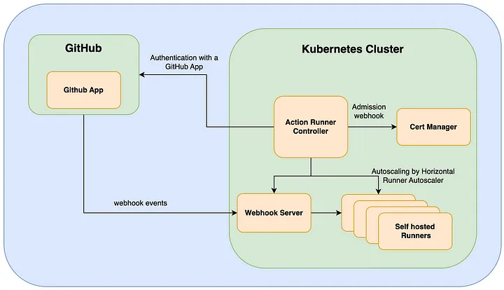

GitHub Action runner are the agents to schedule our job in a  GitHub actions workflow.
There are two types of Runners
- GitHub-hosted: These are agent machines hosted by GitHub.
- Self-hosted: The are agents hosted by the customers of GitHub and thus deployed on the customers server which can be a Virtual machine, a Kubernetes cluster on On-Prem or Cloud.

Since GitHub hosted runner are more public and managed by Github, it  poses some level of security issue as its externally hosted , comes with lot of tools in-built ,  thus posessing higher chances for security risks of malicious attacks and stealing of data etc. To overcome these issues we have option to setup our own GitHub runner which can be hosted on a virtual machine, kubernetes clusters and can be enabled with security protections and restrictions. 

You can install the self-hosted runner at 3 levels.

- Enterprise
  Runners installed at the Enterprise level can be assigned to all the organization or at the specific organization.
- Organization
  Runners installed at the Organization level can be assigned to all the repositories or only specific repository
- Repository
  Runners installed at the Repository level can be assigned to that particular repository only.

To identify the runner you need to apply one or more labels to that and to utilize that you need to mention the label at the runs-on instruction in your workflow file. GitHub Actions will now scan for the runners which has that label and runs the workflow on it.

The most ideal method to self host a GitHub action runner is to deploy it in Kubernetes. This provides more scalability to meet demand , better performance and flexibility to enrish secruirty controls and accessibility. The modern method for self hosting GitHub action runner is using the ARC method.

Actions Runner Controller (ARC) makes it simpler to run self hosted environments on Kubernetes(K8s) cluster.



With ARC you can :

- Deploy self hosted runners on Kubernetes cluster with a simple set of commands.
- Auto scale runners based on demand.
- Setup across GitHub editions including GitHub Enterprise editions and GitHub Enterprise Cloud

To understand more please refer this [Website](https://docs.github.com/en/actions/hosting-your-own-runners)

Installation of Self Hosted runner is a two fold process.

- [Deploy Runner Controller](#deploy-runner-controller)
- [Deploy Self-Hosted Runner](#deploy-self-hosted-runner)

---


## Deploy Runner Controller

Use the following command to download the GitHub Actions Runner Controller Helm Chart in the current directory:

```bash
helm pull --untar oci://ghcr.io/actions/actions-runner-controller-charts/gha-runner-scale-set-controller --version 0.8.1
```

Now, use the following command to deploy the helm chart into your kubernetes cluster:

```bash
helm install arc gha-runner-scale-set-controller/ -n arc-system --create-namespace
```

Sample Output:

```yaml
NOTES:
Thank you for installing gha-runner-scale-set-controller.

Your release is named arc.
```

**NOTE:** The installation takes a few minutes to complete, so please be patient.

Verify that the installation was successful using the following command:

```bash
kubectl get pods -n arc-system
```

Sample Output:

```text
NAME                                     READY   STATUS    RESTARTS   AGE
arc-gha-rs-controller-78c9b88766-8l9zc   1/1     Running   0          5m
```

---

## Deploy Self-Hosted Runner

Use the following command to download the GitHub Actions Runner Helm Chart in the current directory:

```bash
helm pull --untar oci://ghcr.io/actions/actions-runner-controller-charts/gha-runner-scale-set --version 0.8.1
```

Specify the GitHub Repository with which to register this runner in the `githubConfigUrl` field on **line 1** and GitHub Personal Access Token to use with the runner in `githubConfigSecret.github_token` field on **line 4** of [runner-values.yaml](./runner-values.yaml "runner-values.yaml").

```yaml
1 githubConfigUrl: https://github.com/<org-name>/<repo-name> # Replace this with your repo URL
2 
3 githubConfigSecret:
4   github_token: "PAT_TOKEN" # Replace this with your PAT Token
```


Now, use the following command to deploy the helm chart into your kubernetes cluster:

```bash
helm install k8s-runner gha-runner-scale-set -n arc-runner --create-namespace -f runner-values.yaml
```

Sample Output:

```yaml
NOTES:
Thank you for installing gha-runner-scale-set.

Your release is named k8s-runner.
```

**NOTE:** The installation takes a few minutes to complete, so please be patient.

Verify that the installation was successful using the following command:

```bash
kubectl get pods -n arc-system
```

Sample Output:

```text
NAME                                     READY   STATUS    RESTARTS   AGE
k8s-runner-7db9c9f7-listener             1/1     Running   0          5m
```

**NOTE:** Here, the installation name we used (`<your-runner-name>`) will be the name of the runner in GitHub Actions, i.e., we need to use this in the `runs-on` field of GitHub Actions Workflow YAML file.

[Example Workflow File](https://github.com/<org-name>/<repo-name>/blob/main/.github/workflows/exmaple.yml "Example Workflow File"):

```yaml
jobs:
  setup:
    name: Example Job
    runs-on: <your-runner-name> # Here we specify the Installation Name, i.e., k8s-runner in our case
```

---

Please find the sample YAML file code for a runner-value.yaml

```yaml
githubConfigUrl: https://github.com/<org-name>/<repo-name>

githubConfigSecret:
  github_token: "<PAT-TOKEN>"

containerMode:
  type: "kubernetes"

  kubernetesModeWorkVolumeClaim:
    accessModes: ["ReadWriteOnce"]
    storageClassName: "standard-rwo"
    resources:
      requests:
        storage: 1Gi

template:
  spec:
    securityContext:
      fsGroup: 123
    containers:
      - name: runner
        image: ghcr.io/actions/actions-runner:latest
        command: ["/home/runner/run.sh"]
        env:
          - name: ACTIONS_RUNNER_REQUIRE_JOB_CONTAINER
            value: "false"

## maxRunners is the max number of runners the autoscaling runner set will scale up to.
# maxRunners: 5

## minRunners is the min number of idle runners. The target number of runners created will be
## calculated as a sum of minRunners and the number of jobs assigned to the scale set.
# minRunners: 0
```
